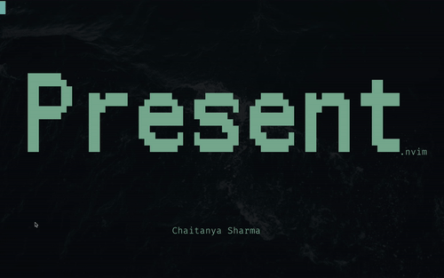

# Presenting.nvim

A Presentation plugin written for [Neovim](https://github.com/neovim/neovim) in Lua



## Installation

You can install Present with your plugin manager of choice

- with [packer.nvim](https://github.com/wbthomason/packer.nvim)

```lua
use {
  'Chaitanyabsprip/present.nvim',
  config = function()
    require('present').setup {
      -- ... your config here
    }
  end,
}
```

- with [lazy.nvim](https://github.com/folke/lazy.nvim)

```lua
use {
  'Chaitanyabsprip/present.nvim',
  opts = {
    -- ... your config here
  },
}
```

## Configuration

### Defaults

Present comes with the following defaults

```lua
  {
    default_mappings = true,
    kitty = {
      normal_font_size = 12,
      zoomed_font_size = 28,
    },
  }
```

You can configure the keymaps for next and previous slide by binding your
desired keys to `:bnext` and `:bprevious`

Present currently only supports zooming in for kitty.

## My Presentation Workflow

I would usually create one file for each slide and name them as `slide-*.md`. I
put all of these files in a directory and that forms my presentation.

I heavily use [toilet](https://github.com/cacalabs/toilet) to create my headings
and sub-headings. I use [vim-unicode-snippets](https://github.com/danielwe/vim-unicode-snippets) to insert
unicode characters like bullets or checks.

You can find a rather naive example displaying in the gif in the `assets/` folder.
